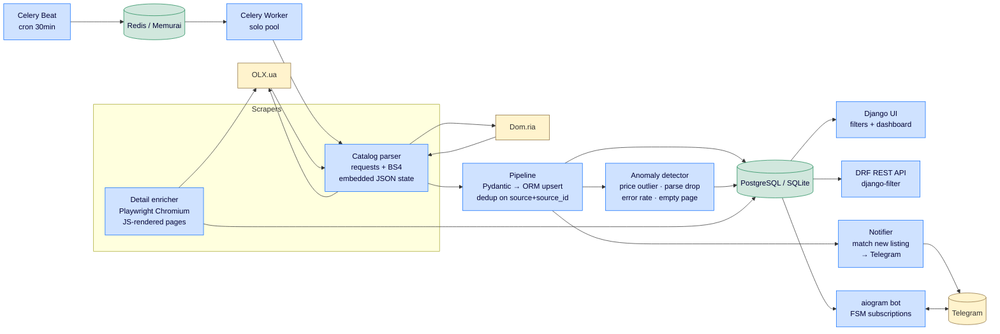

# RealEstate Radar

End-to-end real-estate aggregator: scrapes listings from **OLX** and **Dom.ria**, stores them in PostgreSQL/SQLite, serves a Django web UI + REST API, runs scheduled scrapes via Celery + Redis, and pushes Telegram notifications when new listings match user-defined subscriptions.

Built as a Junior–Middle Python portfolio project. Demonstrates web scraping (static + JS-rendered), data validation, ORM modelling, async bots, scheduled jobs, REST API, anomaly detection, tests, and CI.

[](https://github.com/USER/REPO/actions)

---

## Architecture



## Features

- **Two scrapers** — OLX and Dom.ria, both parsing the embedded `window.__PRERENDERED_STATE__` / `__INITIAL_STATE__` JSON instead of fragile CSS selectors
- **Detail enrichment via Playwright** — OLX detail pages return an empty React shell to plain HTTP, so headless Chromium is used to extract the full description + complete photo gallery
- **Pydantic validation** between scraper and DB; one bad listing never crashes a run
- **Upsert on `(source, source_id)`** — re-scraping is idempotent; param diff is delete-and-recreate per atomic transaction
- **Telegram bot with FSM** — `/subscribe` walks the user through district → max price → rooms; `/list`, `/clear`
- **Notification dedup** — `Notification` table guarantees no user sees the same listing twice
- **Anomaly detection** — flags price outliers (median + ±100× cohort bound to survive bi-modal sale+rent catalogs), high error rates, parse-count drops vs. previous run, empty pages
- **Web UI** — Bootstrap 5 list with filters, detail page with image carousel, dashboard with 30-day Chart.js graph + open-alerts panel
- **REST API** — DRF read-only viewset reuses the same `django-filter` FilterSet as the HTML list
- **Scheduled scraping** — Celery Beat fires `listings.scrape` every 30 min per source via Redis broker
- **Tests + CI** — 32 pytest cases (1.7s), GitHub Actions runs ruff + tests on every push

## Tech stack

| Layer | Choice | Why |
|---|---|---|
| Language | Python 3.11+ (`uv` for deps) | Modern syntax (`StrEnum`, structural pattern matching); `uv` is 10–100× faster than pip |
| Static scraping | `requests` + `beautifulsoup4` + `tenacity` + `fake-useragent` | Industry default; tenacity exponential backoff with narrow retry-on classes |
| JS scraping | `playwright` (Chromium) | Modern API, better than Selenium; supports `wait_for_function` for hydration races |
| Validation | `pydantic` v2 | Wire-format contract between parser and DB |
| Web | Django 5.1 + DRF + django-filter | Fat models, thin views; `update_or_create` for upsert; shared FilterSet for HTML and API |
| Bot | `aiogram` 3.x | Async; FSM out of the box; HTML parse mode |
| DB | PostgreSQL 16 (prod) / SQLite (dev) | `DATABASE_URL` env var switches; no code change |
| Scheduling | Celery + Celery Beat (Redis broker) | Industry standard; on Windows broker = Memurai, worker `--pool=solo` |
| Lint/format | `ruff` | Single tool replaces black + flake8 + isort; speed |
| Tests | `pytest` + `pytest-django` + `responses` | 32 cases run in 1.7s |
| CI | GitHub Actions | `uv sync --frozen` + ruff + pytest |

## Quick start

### Prerequisites

- Python 3.11+
- [`uv`](https://github.com/astral-sh/uv) — `winget install astral-sh.uv` or [official installer](https://astral.sh/uv/)
- (Optional) Redis-compatible broker for scheduled scraping. On Windows: `winget install Memurai.MemuraiDeveloper`

### Setup

```bash
git clone https://github.com/USER/REPO realestate-radar && cd realestate-radar
cp .env.example .env                       # then edit TELEGRAM_BOT_TOKEN
uv sync                                    # installs all deps into .venv (or `venv`)
uv run playwright install chromium         # ~180 MB, one-off
uv run python webapp/manage.py migrate
uv run python webapp/manage.py createsuperuser
```

### Run (Windows; 4 separate PowerShell windows)

```powershell
.\dev.ps1                                   # spawns the four windows below
```

…or manually:

| Process | Command |
|---|---|
| Django web | `python webapp/manage.py runserver` |
| Telegram bot | `python webapp/manage.py run_bot` |
| Celery worker | `python -m celery -A config worker --pool=solo --loglevel=INFO` |
| Celery beat | `python -m celery -A config beat --loglevel=INFO` |

### URLs

- `http://127.0.0.1:8000/` — listing list with sidebar filters
- `http://127.0.0.1:8000/dashboard/` — dashboard with 30-day chart + open alerts
- `http://127.0.0.1:8000/admin/` — Django admin
- `http://127.0.0.1:8000/api/listings/?source=domria&currency=USD&max_price=1000` — REST API

### One-off commands

```bash
# Scrape now (synchronous, no Celery needed)
python webapp/manage.py scrape olx    "https://www.olx.ua/uk/nedvizhimost/kvartiry/kiev/" --pages 3
python webapp/manage.py scrape domria "https://dom.ria.com/uk/arenda-kvartir/kiev/"        --pages 3

# Enrich detail pages via Playwright (only OLX needs it)
python webapp/manage.py enrich --source olx --limit 10
```

### Run tests

```bash
uv run pytest          # 32 cases, ~2 seconds
uv run ruff check .
uv run ruff format --check .
```

## Project structure

```
parser/
├── scraper/                 # source-of-truth Pydantic models + parsers
│   ├── models.py            #   Listing, Price, Location, ListingParam (frozen)
│   ├── http.py              #   Session, UA rotation, tenacity retries, polite_sleep
│   ├── pagination.py        #   page_url helper
│   ├── recon.py             #   tool: probe a new site for embedded JSON state
│   ├── inspect_state.py     #   tool: pretty-print the state structure
│   ├── browser.py           #   Playwright context manager (pinned desktop UA)
│   └── sources/
│       ├── olx.py           #   catalog parser via __PRERENDERED_STATE__
│       ├── olx_detail.py    #   detail enricher via Playwright
│       └── domria.py        #   catalog parser via __INITIAL_STATE__
├── webapp/                  # Django project
│   ├── config/
│   │   ├── settings.py      #   env-driven (DATABASE_URL, CELERY_BROKER_URL)
│   │   ├── celery.py        #   Celery app, autodiscovers tasks
│   │   └── urls.py
│   └── listings/
│       ├── models.py        #   Listing, ListingParam, ScrapeRun, ScrapeAlert,
│       │                    #   TelegramUser, Subscription, Notification
│       ├── pipelines.py     #   Pydantic → ORM upsert (transactional)
│       ├── tasks.py         #   run_scrape + @shared_task wrapper
│       ├── anomaly.py       #   price_outlier, parse_drop, error_rate, empty_page
│       ├── filters.py       #   shared FilterSet (HTML + API)
│       ├── views.py         #   ListView, DetailView, DashboardView
│       ├── api_views.py     #   DRF ReadOnlyModelViewSet
│       ├── admin.py         #   list_display + filters for all models
│       └── management/commands/
│           ├── scrape.py    #   manual run; thin wrapper around tasks.run_scrape
│           ├── enrich.py    #   Playwright detail enrichment with async ORM
│           └── run_bot.py   #   long-polling entry point
├── bot/                     # aiogram package
│   ├── main.py              #   Dispatcher + MemoryStorage + 3 routers
│   ├── notifier.py          #   match new listing to subscriptions, send TG
│   ├── formatting.py        #   HTML-formatted Telegram messages
│   └── handlers/
│       ├── start.py         #   /start, /help
│       ├── subscribe.py     #   FSM: district → max_price → rooms
│       └── manage.py        #   /list, /clear
├── tests/                   # 32 pytest cases (1.7s total)
├── .github/workflows/ci.yml # ruff + pytest on every push
├── CLAUDE.md                # conventions, AI guardrails
└── AI_WORKFLOW.md           # log of AI-assisted development sessions
```

## Notable design decisions

**JSON state over CSS selectors.** Both target sites server-render a JSON state blob in `<script>window.__*=...`. Parsing that blob is one order of magnitude more stable than picking class names like `css-a3xv7p` that get rotated on every deploy. Discovered via `scraper/recon.py` — kept the recon tool around for future sources.

**Playwright only where it's required.** Listing pages use SSR; the detail pages do not. The detail enricher is a separate code path (`enrich` command) that opens Chromium only for those URLs. ~5–20× slower than `requests` per URL, so used surgically.

**`DATABASE_URL` env var.** Both SQLite and PostgreSQL are supported. Dev runs on SQLite (no setup); production-style runs in Docker would set `DATABASE_URL=postgresql://...`. The settings parser handles both schemes natively — no `dj-database-url` dependency for 30 lines of code.

**Bi-modal-aware price outlier detection.** Several OLX URLs mix sale (millions UAH) and rent (tens of thousands) in the same catalog. A naive mean would flag every rental against the sale-dominated average. The detector restricts the peer cohort to listings within ±100× of the candidate's own price, then uses median (not mean). False-positive rate dropped ~3× on the same data when switching.

**Bot notifications survive scraper restarts.** The `Notification` table records every (user, listing) push so re-saving a listing (which happens on every scrape) never re-pings users. Without it, every 30-minute cron would spam subscribers.

**Async ORM at the bot boundary, sync everywhere else.** Bot handlers and notifier are async (aiogram), Django ORM is sync. `sync_to_async` wraps ORM helpers at the boundary; the rest of the app stays in sync code (simpler debugging, simpler tests).

## Known limitations / what I'd do next

- **No `operation_type` field** (sale / rent) on `Listing`. The price-outlier detector handles this with magnitude-bounded peers but the right fix is to infer the type from URL/category and filter on it explicitly.
- **`db.sqlite3` instead of Postgres** because BIOS virtualisation is off on the dev machine → Docker doesn't run → no Postgres container. SQLite is fully equivalent at this scale; one env var to switch.
- **No currency conversion** in subscriptions. If a user subscribes in USD and a listing is in UAH (or vice versa), no match. Right fix is daily NBU rate fetch and convert both to a base currency at match time.
- **Notifier creates a fresh `Bot` per call.** Fine at one-scrape-every-30-min volume; if scrapes get more frequent, a long-lived `Bot` instance shared between scrape command and notifier would save ~200 ms per notification.
- **Tests don't cover the bot handlers themselves**, only the notifier. aiogram's test client is heavier than what was justified for the time budget.

## AI workflow

This project is built primarily with [Claude Code](https://docs.anthropic.com/claude/docs/claude-code). The decision log of what worked, what got rewritten, and the prompts that made the difference lives in [`AI_WORKFLOW.md`](AI_WORKFLOW.md).

## License

MIT
